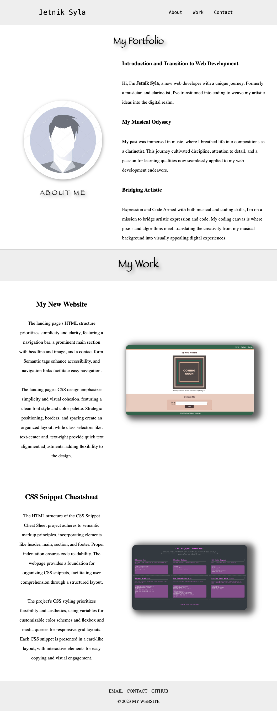

# Jetnik's Portfolio

## Overview

This portfolio showcases the work and journey of **Jetnik Syla**, a web developer with a unique background in music. The portfolio is designed to provide employers with insights into Jetnik's skills, experience, and artistic approach to web development.

## Key Features

#### **Navigation:** 
Simple navigation allows easy access to sections about the developer, their work, and contact information.

#### **About Me Section:** 
Learn about **Jetnik's** transition from a clarinetist to a web developer, highlighting the intersection of artistic expression and code.

#### **My Work Section:**
 Explore projects like **"My New Website"** and **"CSS Snippet Cheatsheet,"** each accompanied by a detailed description, emphasizing clean HTML structure and responsive CSS design.

#### **Responsive Design:**
The portfolio is responsive, adapting to various screen sizes and devices for optimal viewing.

#### **Contact Information:** 
 **Jetnik's** email, phone number, and GitHub profile are easily accessible in the footer.

## Technical Details

#### **Smooth Scrolling:**
Implemented smooth scrolling for a seamless user experience using scroll-behavior: smooth;.

#### **CSS Styling:**
 Utilized a combination of Flexbox, media queries, and creative styling for a visually appealing and responsive layout.

#### **Focus Styles:**
 Enhanced accessibility with focus styles on links, providing a clear indication of the selected link.

#### **Tooltip Effect:**
Implemented a tooltip effect on footer links for additional information, enhancing user interaction.

## Usage

1. Clone the repository.
2. Open the ``index.html`` file in your preferred web browser.
3. Navigate through sections using the provided links in the header.

## Responsive Design

* The portfolio is designed to be responsive, ensuring a consistent and engaging experience across different devices.

* Media queries are used to adjust layout and styling for screens with a maximum width of 768px.

## Contact

For inquiries or collaboration opportunities, please feel free to reach out to **Jetnik Syla:**

* #### **Email:** sjetnik@gmail.com

* #### **Phone:** + (1) 914-415-9578

* #### **GitHub Profile:** Jetnik Syla

##
                                     © 2023 Jetnik Syla - All Rights Reserved

### Portfolio Website

Explore my CSS portfolio website [here](https://jetniksyla.github.io/css_portfolio/). Showcase of my web development projects and skills.

## Project Screenshot

